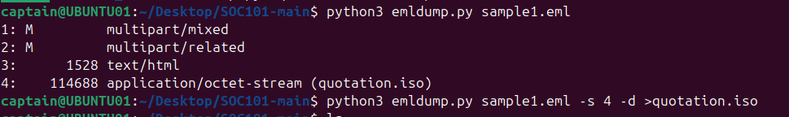
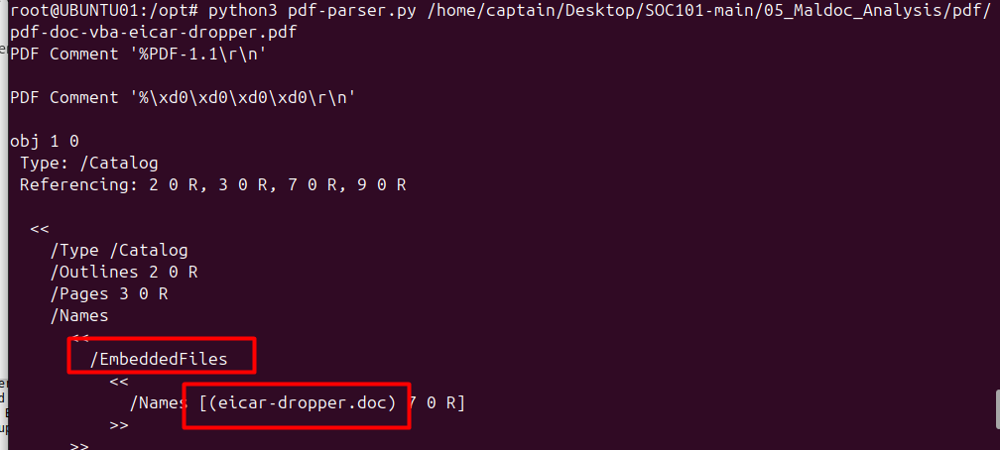
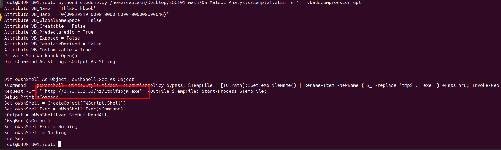
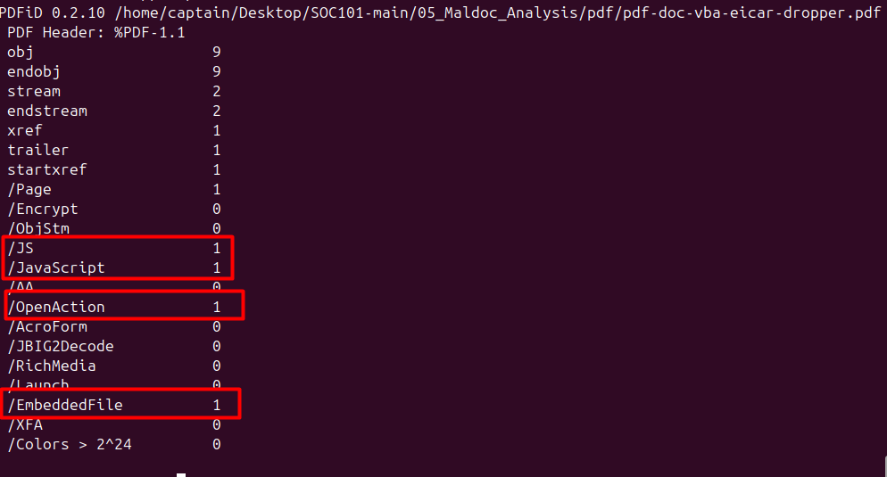
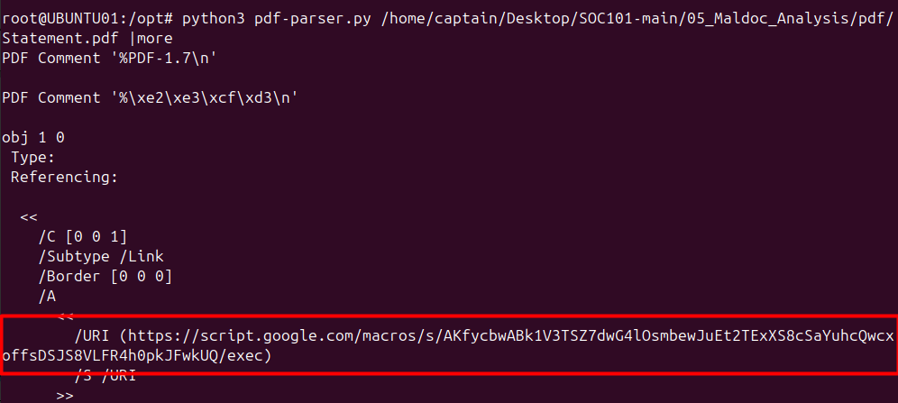
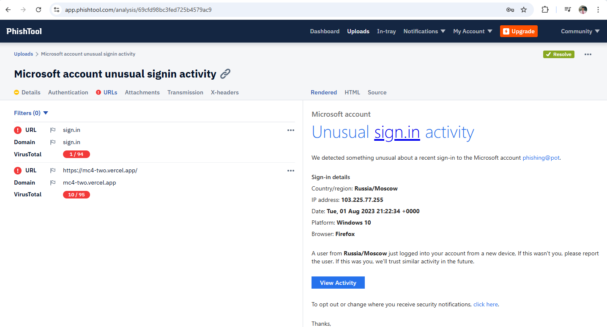
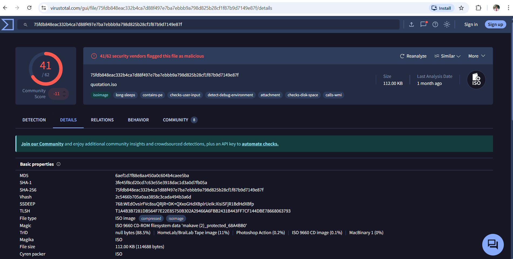
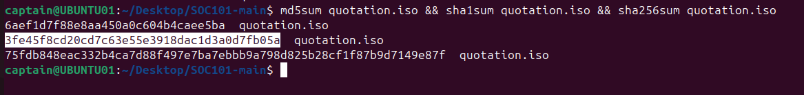
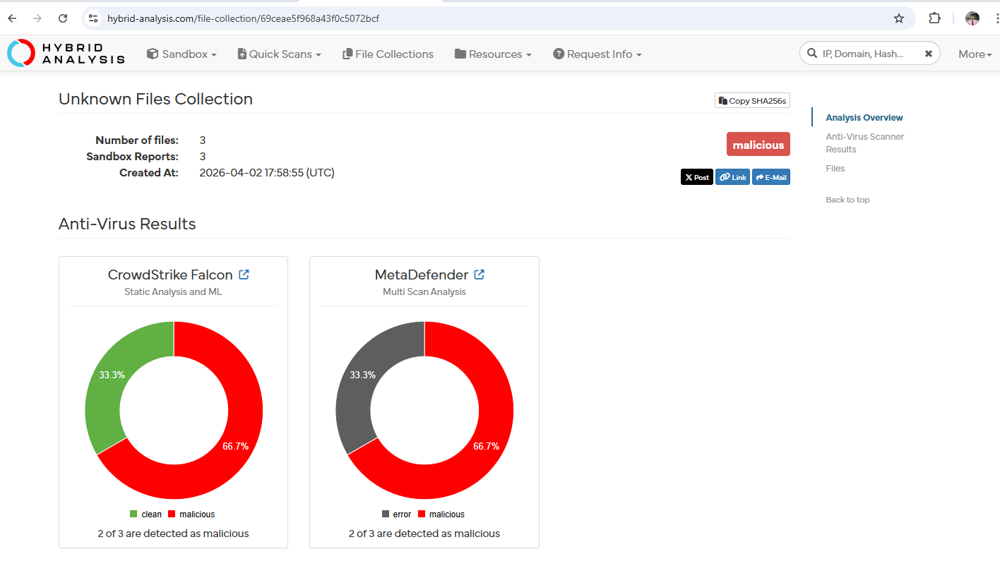

# Phishing Email Analysis

> ⚠️ Disclaimer: This analysis was conducted in a controlled training environment
> as part of SOC analyst development. The phishing email sample was provided for
> educational purposes only. No real credentials or systems were accessed.

## Overview
A structured forensic analysis of a phishing email impersonating a major brand,
conducted as part of SOC analyst training. Covers the full investigation workflow
from initial triage through containment recommendations, following real-world
SOC analyst methodology.

## What Was Done
- Performed full email header inspection and sender infrastructure tracing
- Verified SPF, DKIM, and DMARC authentication — all three returned failure
- Identified sender spoofing through mismatched Return-Path and sender IP
- Extracted and analyzed malicious attachments using emldump.py
- Performed VBA macro extraction from maldoc using oledump.py
- Analyzed embedded malicious elements in PDF using pdfid.py and pdf-parser.py
- Analyzed the embedded URL using VirusTotal, URLVoid, and PhishTool,
  confirming an active credential harvesting portal
- Submitted suspicious file hashes to Hybrid Analysis, confirmed as malicious
- Documented findings in a structured SOC report with IOC summary and
  reactive and proactive containment recommendations

## Investigation Methodology

| Phase | Action |
|---|---|
| Triage | Email header inspection, sender infrastructure tracing |
| Authentication | SPF, DKIM, DMARC verification |
| Attachment Analysis | emldump.py extraction, oledump.py macro analysis |
| PDF Analysis | pdfid.py and pdf-parser.py deep inspection |
| URL Analysis | VirusTotal, URLVoid, PhishTool |
| Hash Analysis | Hybrid Analysis sandbox submission |
| Reporting | Structured SOC report with containment recommendations |

## Key Findings

| Finding | Result |
|---|---|
| SPF | Fail |
| DKIM | Fail |
| DMARC | Fail |
| Return-Path | Mismatched — sender spoofing confirmed |
| Embedded URL | Active credential harvesting portal |
| Attachment | Malicious — VBA macro confirmed |
| Hash Reputation | Flagged malicious on Hybrid Analysis |

## Tools Used

| Tool | Purpose |
|---|---|
| emldump.py | Email parsing and malicious attachment extraction |
| oledump.py | VBA macro extraction from maldoc |
| pdfid.py | PDF malicious element identification |
| pdf-parser.py | Deep PDF structure analysis |
| PhishTool | Automated phishing artifact investigation |
| VirusTotal | URL and IP reputation analysis |
| URLVoid | URL behavioral analysis |
| Hybrid Analysis | Automated malware sandbox analysis |

## Report
📄 [Download Full Analysis Report](report/Phishing-Analysis.pdf)

## Screenshots

### Extracting Malicious Attachment with emldump

### Finding the Embedded File

### Maldoc Analysis with oledump.py

### PDF Analysis with pdfid.py

### PDF Deep Analysis with pdf-parser.py

### Automated Email Analysis with PhishTool

### Flagged as Malicious

### Hashes of Suspicious File

### Hybrid Analysis Report

## Author
**Rakib Mahmud Nadir**  
Security Operations | Offensive Security Professional  
[Portfolio](https://rakibnadir33.github.io/rakibnadir.github.io/) · [LinkedIn](https://linkedin.com/in/rakib-nadir)
